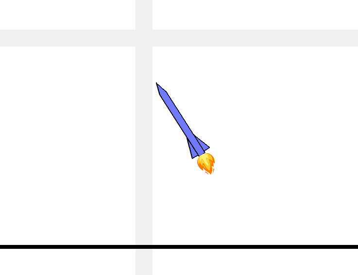

# pyrocket

A 2d self-landing rocket simulation written in Python.



## Requirements

You need `pygame` and `pymunk` installed, e.g. using

```bash
pip3 install --user pygame
pip3 install --user pymunk
```

## Launch

Run

```python3
python3 main.py
```

to start the simulation.

## Controls

| Key        |                                    |
| ---------- | :--------------------------------: |
| Up/Down    |          Throttle control          |
| Left/Right |       Thrust vector control        |
| Space      |         Start/Stop engine          |
| 0-9        | Switch stability assist mode (SAS) |
| Mouse      |          add an obstacle           |
| P          |               pause                |
| R          |         restart the rocket         |

## Instructions

- Launch the rocket by hitting _Space_.
- Play with the arrow keys to control the thrust and guide the rocket anywhere you want.
- If you lose control, use the stability augmentation system (SAS) to regain control:
  - 0: SAS off / no stability assist / manual control
  - 1: stability assist only, keeps the rocket from spinning
  - 2: stability assist + keeps the rocket upright
  - 3: keeps the rocket upright and cancels its velocity
  - 4: attempts to land the rocket automatically
- If you want to make it more difficult for the rocket, click anywhere to add balls as obstacles
